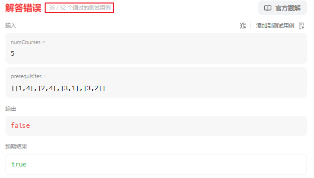

#### [Q207. 课程表](https://leetcode.cn/problems/course-schedule/description/?envType=study-plan-v2&envId=top-100-liked)

你这个学期必须选修 `numCourses` 门课程，记为 `0` 到 `numCourses - 1` 。

在选修某些课程之前需要一些先修课程。 先修课程按数组 `prerequisites` 给出，其中 `prerequisites[i] = [ai, bi]` ，表示如果要学习课程 `ai` 则 **必须** 先学习课程 `bi` 。

- 例如，先修课程对 `[0, 1]` 表示：想要学习课程 `0` ，你需要先完成课程 `1` 。

请你判断是否可能完成所有课程的学习？如果可以，返回 `true` ；否则，返回 `false` 。


**示例 1：**

```
输入：numCourses = 2, prerequisites = [[1,0]]
输出：true
解释：总共有 2 门课程。学习课程 1 之前，你需要完成课程 0 。这是可能的。
```

**示例 2：**

```
输入：numCourses = 2, prerequisites = [[1,0],[0,1]]
输出：false
解释：总共有 2 门课程。学习课程 1 之前，你需要先完成课程 0 ；并且学习课程 0 之前，你还应先完成课程 1 。这是不可能的。
```


##### 第一种思路：

1. 首先判断需要选修的课程数量是否小于 `prerequisites[i].length` 。
2. 要针对 `prerequisites` 来考虑，即：对于 `prerequisites` 中的任何一个子数组，其中的元素顺序要保持一致；换一种思路来讲，从 `prerequisites` 中找到最大的子数组，那么，其他的任何数组都应该是最大子数组的子数组，即：其中的基本顺序要保证。
   - 那么我们就需要判断是否为子数组的算法，即：
     1. 初始化两个指针，一个指向主数组，一个指向子数组。
     2. 逐步移动两个指针，比较它们指向的元素是否相同。
     3. 如果相同，两个指针同时向后移动。
     4. 如果不同，只移动主数组的指针。
     5. 如果子数组的指针移动到末尾，说明子数组是主数组的连续子序列。

如果所有数组都符合要求，则返回 `true` ；否则，返回 `false` 。

*以上思路存在弊端，即：思路默认了其他数组皆是最大数组的子数组，但是实际上还会遇到prerequisites =[[1,4],[2,4],[3,1],[3,2]]的情况，这样就会导致直接判定 `false`*

因此该思路无法解决上述问题，但是此处还是给出代码：

```java
class Solution {
    public boolean canFinish(int numCourses, int[][] prerequisites) {
        int maxNum = 0;
        int maxIndex = 0;
        for (int i = 0; i < prerequisites.length; i++) {
            if (prerequisites[i].length > maxNum) {
                maxNum = prerequisites[i].length;
                maxIndex = i;
            }
        }
        if (numCourses < maxNum) {
            return false;
        }
        for (int i = 0; i < prerequisites.length; i++) {
            if (i == maxIndex)
                continue;
            if (!isSubarray(prerequisites[maxIndex], prerequisites[i])) {
                return false;
            }
        }
        return true;
    }
    public boolean isSubarray(int[] num, int[] subArray) {
        int m = num.length;
        int n = subArray.length;
        int i = 0;  // 主数组指针
        int j = 0;  // 子数组指针
        while (i < m && j < n) {
            if (num[i] == subArray[j]) {
                i++;
                j++;
            } else {
                i++;
            }
        }
        return j == n;
    }
}
```




##### 第二种思路：图的拓扑排序

这种思路就是将数组 `prerequisites` 中的元素抽象为图的拓扑排序，如果拓扑排序可以完成，则返回 `true` ；若拓扑排序陷入死锁，则返回 `false` 。

**具体思路如下：**

1. **使用拓扑排序**：将课程之间的依赖关系表示成有向图，每个课程是图中的一个节点，依赖关系是有向边。然后进行拓扑排序，如果能够完成拓扑排序，说明课程表中的课程能够按照依赖关系顺利学习，否则说明存在循环依赖，无法完成课程表。
2. **优化拓扑排序算法**：在拓扑排序过程中，每次都需要遍历所有的边，找到入度为0的节点，然后删除以该节点为起点的边。你可以考虑使用队列来优化这个过程，将入度为0的节点入队，并在遍历时不断更新节点的入度。

**代码：**

```java
class Solution {
    public boolean canFinish(int numCourses, int[][] prerequisites) {
        // 初始化邻接表和入度数组
        List<List<Integer>> adjList = new ArrayList<>();
        int[] indegree = new int[numCourses];
        for (int i = 0; i < numCourses; i++) {
            adjList.add(new ArrayList<>());
        }

        // 构建邻接表和入度数组
        for (int[] pair : prerequisites) {
            int course = pair[0];
            int prerequisite = pair[1];
            adjList.get(prerequisite).add(course);
            indegree[course]++;
        }

        // 使用队列进行拓扑排序
        Queue<Integer> queue = new LinkedList<>();
        for (int i = 0; i < numCourses; i++) {
            if (indegree[i] == 0) {
                queue.offer(i);
            }
        }

        int count = 0; // 记录已经完成的课程数
        while (!queue.isEmpty()) {
            int course = queue.poll();
            count++;

            // 更新相邻课程的入度
            for (int neighbor : adjList.get(course)) {
                if (--indegree[neighbor] == 0) {
                    queue.offer(neighbor);
                }
            }
        }

        // 如果完成的课程数等于总课程数，说明可以完成课程表
        return count == numCourses;
    }
}
```

**通过测试：**

`执行用时分布`：`5ms`			`击败58.03%使用 Java 的用户`

`消耗内存分布`：`43.62MB`	`击败33.90%使用 Java 的用户`