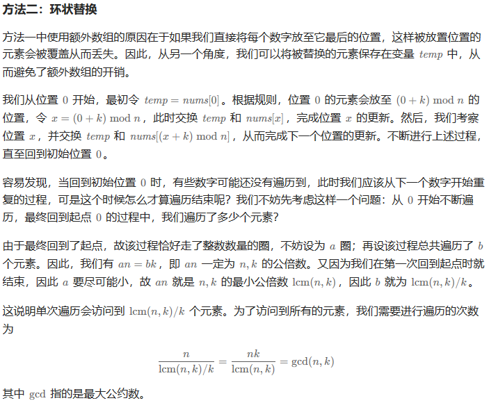

---

---

#### Q189.轮转数组

给定一个整数数组 `nums`，将数组中的元素向右轮转 `k` 个位置，其中 `k` 是非负数。

**示例 1:**

```
输入: nums = [1,2,3,4,5,6,7], k = 3
输出: [5,6,7,1,2,3,4]
解释:
向右轮转 1 步: [7,1,2,3,4,5,6]
向右轮转 2 步: [6,7,1,2,3,4,5]
向右轮转 3 步: [5,6,7,1,2,3,4]
```

**示例 2:**

```
输入：nums = [-1,-100,3,99], k = 2
输出：[3,99,-1,-100]
解释: 
向右轮转 1 步: [99,-1,-100,3]
向右轮转 2 步: [3,99,-1,-100]
```

 

##### 第一种思路：找规律，借用新数组存储调换

已知要将数组向右轮转，经过观察我们发现：

原本在 `i` 位置上的元素经过调换来到了 `(i+k)%n` 的位置（其中`n = nums.length` ）

因此，我们得到以下代码：

```java
class Solution {
    public void rotate(int[] nums, int k) {
        int n = nums.length;
        int[] a = new int[n];
        for (int i = 0; i < n; i++){
            a[(i+k)%n] = nums[i];
        }
        // 使用 System.arraycopy 方法来复制 array1 到 array2。
        // 该方法接受源数组、源数组的起始位置、目标数组、目标数组的起始位置和要复制的元素数量作为参数。
        System.arraycopy(a, 0, nums, 0, n);
    }
}
```

**通过测试：**

`执行用时分布`：`1ms`				`击败62.71%使用 Java 的用户`

`消耗内存分布`：`55.90MB`	    `击败60.26%使用 Java 的用户`


##### 第二种思路：

利用一个临时的变量`temp`来替代数组`a`

即：最初使`temp = nums[0]`找到`nums[0]`的新位置，并使`temp`等于新位置上的元素，进而再次寻找，直到循环完整个数组。

本质上将问题换成了数学推导问题，还要考虑如何确定整个数组循环结束的问题。




##### 第三种思路：数组翻转

该方法基于如下的事实：当我们将数组的元素向右移动 `k` 次后，尾部 `k  mod  n` 个元素会移动至数组头部，其余元素向后移动 `k  mod  n` 个位置。

该方法为数组的翻转：

​	1.我们可以先将所有元素翻转，这样尾部的 `k mod n` 个元素就被移至数组头部；

​	2.然后我们再翻转 `[0,k mod n−1]` 区间的元素和 `[k mod n,n−1] `区间的元素即能得到最后的答案。

```java
class Solution {
    public void rotate(int[] nums, int k) {
        k %= nums.length;
        reverse(nums, 0, nums.length - 1);
        reverse(nums, 0, k - 1);
        reverse(nums, k, nums.length - 1);
    }

    public void reverse(int[] nums, int start, int end) {
        while (start < end) {
            int tmp = nums[start];
            nums[start] = nums[end];
            nums[end] = tmp;
            start++;
            end--;
        }
    }
}
```

**通过测试：**

`执行用时分布`：`0ms`				`击败100%使用 Java 的用户`

`消耗内存分布`：`56.09MB`	    `击败39.92%使用 Java 的用户`
