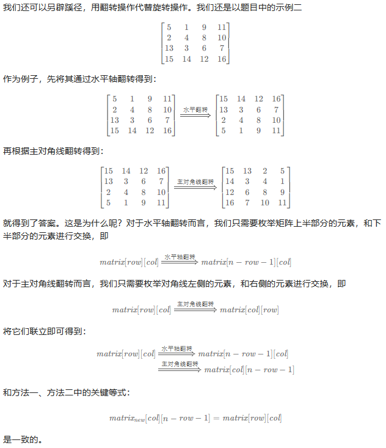

#### [Q48. 旋转图像](https://leetcode.cn/problems/rotate-image/description/?envType=study-plan-v2&envId=top-100-liked)

给定一个 *n* × *n* 的二维矩阵 `matrix` 表示一个图像。请你将图像顺时针旋转 90 度。

你必须在**[ 原地](https://baike.baidu.com/item/原地算法)** 旋转图像，这意味着你需要直接修改输入的二维矩阵。**请不要** 使用另一个矩阵来旋转图像。

**示例 1：**


```
输入：matrix = [[1,2,3],[4,5,6],[7,8,9]]
输出：[[7,4,1],[8,5,2],[9,6,3]]
```

**示例 2：**


```
输入：matrix = [[5,1,9,11],[2,4,8,10],[13,3,6,7],[15,14,12,16]]
输出：[[15,13,2,5],[14,3,4,1],[12,6,8,9],[16,7,10,11]]
```

 

##### 第一种思路：

对于一个 `4 * 4` 的数组而言：

```
[0,0] => [0,3]	[0,1] => [1,3]	[0,2] => [2,3]	[0,3] => [3,3]
[1,0] => [0,2]	[1,1] => [1,2]	[1,2] => [2,2]	[1,3] => [3,2]
[2,0] => [0,1]	[2,1] => [1,1]	[2,2] => [2,1]	[2,3] => [3,1]
[3,0] => [0,0]	[3,1] => [1,0]	[3,2] => [2,0]	[3,3] => [3,0]
```

规律就是：要将数组分层来看

对于一个 `4 * 4` 的数组来说，元素的位置变化为：

```
[i,j] => [j,3-i]
```

但是我们很难去进行循环，我们难以确定循环结束的标志和在原地的条件下如何进行循环。

比如：我们整行地进行移动，

在第一行移动时，如果我们借用第一行来存储被替换的数据，则会遇到数据冲突的问题，即：4抢了1的位置，而16又争夺了1的位置。

```
1	2	3	4		13	9	5	16		而目标是：	 13	 9	 5	 1
5	6	7	8		3	10	11	15					14	10	6	2
9	10	11	12		2	6	7	14					15	11	7	3
13	14	15	16		1	12	8	4					16	12	8	4
int tmp = matrix[i][j]
matrix[i][j] = matrix[j][n-i-1]
matrix[j][n-i-1] = tmp
===================================================================
但是我们发现主对角线的元素及其附近位置是正确的，副对角线的元素及其附近位置是相反的
√	√	√	×
×	√	×	×
×	×	√	×
×	√	√	√	而错的元素中心对成一下就是对的了
```

我未能解决该问题，所以采用最简单的**辅助数组**的方式来解决该问题。

代码如下：

```java
class Solution {
    public void rotate(int[][] matrix) {
        int row = matrix.length;
        int col = matrix[0].length;
        int[][] a = new int[row][col];
        int n = row - 1;
        for (int i = 0; i < row; i++) {
            for (int j = 0; j < col; j++) {
                a[i][j] = matrix[n-j][i];
            }
        }
        for (int i = 0; i < row; i++){
            for (int j = 0; j < col; j++){
                matrix[i][j] = a[i][j];
            }
        }
    }
}
```

**通过测试：**

`执行用时分布`：`0ms`			`击败100%使用 Java 的用户`

`消耗内存分布`：`41.25MB`	`击败20.77%使用 Java 的用户`


##### 第二种思路：用翻转代替旋转



代码：

```java
class Solution {
    public void rotate(int[][] matrix) {
        int row = matrix.length;
        int col = matrix[0].length;
        int n = row - 1;
        for (int i = 0; i < row / 2; i++) {
            for (int j = 0; j < col; j++) {
                int tmp = matrix[i][j];
                matrix[i][j] = matrix[n-i][j];
                matrix[n-i][j] = tmp;
            }
        }
        for (int i = 0; i < row; i++){
            for (int j = 0; j < i; j++){
                int tmp = matrix[i][j];
                matrix[i][j] = matrix[j][i];
                matrix[j][i] = tmp;
            }
        }
    }
}
```

**通过测试：**

`执行用时分布`：`0ms`			`击败100%使用 Java 的用户`

`消耗内存分布`：`41.43MB`	`击败46.18%使用 Java 的用户`


##### <a href="https://leetcode.cn/problems/rotate-image/solutions/526980/xuan-zhuan-tu-xiang-by-leetcode-solution-vu3m/?envType=study-plan-v2&envId=top-100-liked" style="text-decoration: none;">第三种思路：原地旋转</a>

