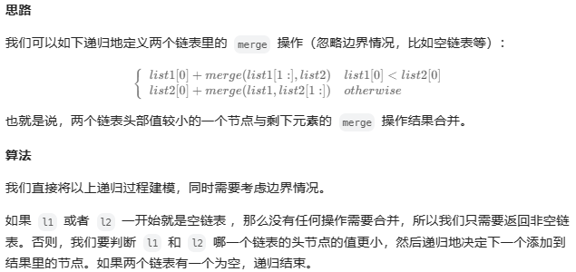

#### [Q21. 合并两个有序链表](https://leetcode.cn/problems/merge-two-sorted-lists/?envType=study-plan-v2&envId=top-100-liked)

将两个升序链表合并为一个新的 **升序** 链表并返回。新链表是通过拼接给定的两个链表的所有节点组成的。 

**示例 1：**


```
输入：l1 = [1,2,4], l2 = [1,3,4]
输出：[1,1,2,3,4,4]
```

**示例 2：**

```
输入：l1 = [], l2 = []
输出：[]
```

**示例 3：**

```
输入：l1 = [], l2 = [0]
输出：[0]
```

 

##### 第一种思路：比较插入

最简单的思路，先比较再插入。

代码：

```java
/**
 * Definition for singly-linked list.
 * public class ListNode {
 *     int val;
 *     ListNode next;
 *     ListNode() {}
 *     ListNode(int val) { this.val = val; }
 *     ListNode(int val, ListNode next) { this.val = val; this.next = next; }
 * }
 */
class Solution {
    public ListNode mergeTwoLists(ListNode list1, ListNode list2) {
        ListNode dummy = new ListNode(); // 创建一个虚拟头节点
        ListNode current = dummy; // 用于遍历结果链表

        while (list1 != null && list2 != null) {
            if (list1.val <= list2.val) {
                current.next = list1;
                list1 = list1.next;
            } else {
                current.next = list2;
                list2 = list2.next;
            }
            current = current.next; // 更新 current 指针
        }

        // 处理某一个链表遍历完后，将另一个链表剩余部分连接到结果链表的末尾
        if (list1 != null) {
            current.next = list1;
        }
        if (list2 != null) {
            current.next = list2;
        }
        return dummy.next; // 返回虚拟头节点的下一个节点，即为合并后的链表的头节点
    }
}
```

**通过测试：**

`执行用时分布`：`0ms`			`击败100%使用 Java 的用户`

`消耗内存分布`：`41.52MB`	`击败23.90%使用 Java 的用户`


##### 第二种思路：递归



代码：

```java
class Solution {
    public ListNode mergeTwoLists(ListNode l1, ListNode l2) {
        if (l1 == null) {
            return l2;
        } else if (l2 == null) {
            return l1;
        } else if (l1.val < l2.val) {
            l1.next = mergeTwoLists(l1.next, l2);
            return l1;
        } else {
            l2.next = mergeTwoLists(l1, l2.next);
            return l2;
        }
    }
}
```

